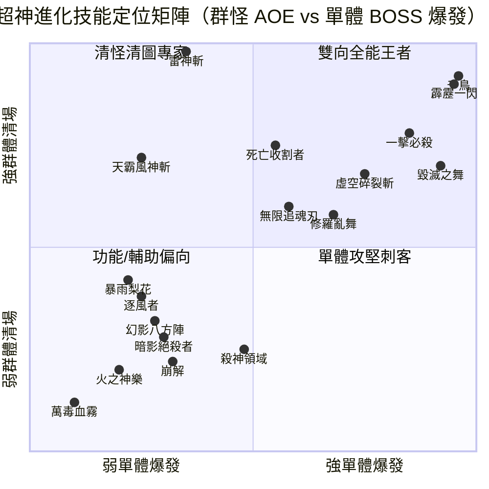

# ⚔️ TASK-238：全 18 招「超神進化」技能全面 DPS 基準測試與前後對比報告

> **報告版本**：v1.0  
> **測試日期**：2026-08-20  
> **負責測試**：Antigravity (QA & Simulation Engine)  
> **測試範圍**：6 大技能群組（突刺、迴旋斬、飛刀、疾風斬、血刃斬、雙刀亂舞），共 18 個超神進化分支與 6 個未點超神進化（1~7 階滿級）基礎技能，合計 72 場無頭高精度戰鬥模擬。

---

## 1. 測試環境與設定規範

### 1.1 角色屬性與裝備配置
* **裝備等級與強化**：
  * 全身 13 格裝備（武器、副手、頭盔、護肩、胸甲、腰帶、手套、護腕、護腿、鞋子、戒指×2、項鍊）全數為 **100 級傳奇（Legendary）**。
  * 強化等級：**+40**（詞條屬性乘數為 $1 + 40 \times 0.05 = 3.0\times$）。
  * 角色基礎面板攻擊力（ATK）達 **1,067,292 ～ 1,939,192**。
* **技能等級設定**：
  * **未點超神進化組（對照組）**：第 1~7 階技能全數升至 Lv.10（滿級），超神進化欄位為空（No Ult）。
  * **超神進化組（實驗組）**：第 1~7 階技能全數升至 Lv.10（滿級），超神進化第 8 階升至 Lv.10（滿級）。

### 1.2 機制專屬裝備詞條適配
所有裝備均嚴格遵守「針對技能 1~8 階機制需求，每件裝備至少帶有兩條專屬受惠詞條」之規範：

* **突刺（Thrust）**：
  * `幻影八方陣`：配置 `evasion`（絕對閃避）+ `aoeDmg`（範圍傷）+ `atkPct` + `critDmg` + `cdr`。
  * `暗影絕殺者`：配置 `aspd`（攻擊速度）+ `pPen`（物理穿透）+ `atkPct` + `critDmg` + `cdr`。
  * `一擊必殺`：配置 `atkPct`（攻擊%）+ `critDmg`（暴擊傷害）+ `pPen` + `cdr` + `hit`。
* **迴旋斬（Cleave）**：
  * `虛空碎裂斬`：配置 `aoeDmg` + `critDmg` + `atkPct` + `atkFlat` + `cdr`。
  * `逐風者`：配置 `elemDmgWind`（風傷%）+ `dmgVsWind`（對風傷%）+ `atkPct` + `critDmg` + `cdr`。
  * `天霸風神斬`：配置 `aoeDmg` + `atkPct` + `critDmg` + `cdr` + `pPen`。
* **飛刀（Knife）**：
  * `暴雨梨花 / 死亡收割者 / 無限追魂刃`：配置 `critRate`（100% 滿暴擊以常態觸發神速飛刀減 CD）+ `aoeDmg` / `atkPct` + `critDmg` + `cdr`。
* **疾風斬（Gale）**：
  * `霹靂一閃`：配置 `aspd`（高速累積連擊段數）+ `critRate` + `atkPct` + `critDmg` + `cdr`。
  * `雷神斬`：配置 `elemDmgLightning`（閃電傷%）+ `dmgVsLightning` + `atkPct` + `critDmg` + `cdr`。
  * `千鳥`：配置 `aoeDmg` + `atkPct` + `critDmg` + `cdr` + `pPen`。
* **血刃斬（Bloodblade）**：
  * `殺神領域`：配置 `atkPct` + `critDmg` + `atkFlat` + `cdr` + `pPen`。
  * `萬毒血霧`：配置 `elemDmgPoison`（毒傷%）+ `dmgVsPoison` + `atkPct` + `cdr` + `critDmg`。
  * `崩解`：配置 `elemDmgPoison` + `atkPct` + `dmgVsPoison` + `critDmg` + `cdr`。
* **雙刀亂舞（Dualdance）**：
  * `毀滅之舞`：配置 `hpPct`（生命上限支持自傷施放）+ `atkPct` + `critDmg` + `cdr` + `pPen`。
  * `火之神樂`：配置 `elemDmgFire`（火傷%）+ `dmgVsFire` + `atkPct` + `critDmg` + `cdr`。
  * `修羅亂舞`：副手裝備第二把雙手巨劍（兩把 Greatsword 享受雙手詞條 +40% 強化加成）+ `atkPct` + `critDmg` + `cdr` + `pPen`。

### 1.3 測試地圖與三種波次情境（100 級冰原 Icefield）
* **場景 1（小怪群戰）**：小怪 20 隻/波，每 2.0 秒出 1 波，連續出 10 波（共計 **200 隻**；單隻 HP ~1,296,000 / DEF 6,496）。
* **場景 2（菁英攻堅）**：菁英怪 5 隻/波，每 2.0 秒出 1 波，連續出 5 波（共計 **25 隻**；單隻 HP ~5,185,000 / DEF 6,496）。
* **場景 3（單體 BOSS）**：1 隻 BOSS（HP **~19,446,000** / DEF 12,992）。

---

## 2. 基礎（未點超神）vs 超神進化（第 8 階）完整對比總表

> **指標說明**：
> * **平均 DPS**：該場景輸出總傷害 $\div$ 戰鬥通關耗時。
> * **通關耗時**：第 1 波怪生成至場上最後一隻怪被擊殺之秒數（小怪第 10 波於 18.0s 生成；菁英第 5 波於 8.0s 生成）。
> * **擊殺數**：清場完畢敵人數 / 總刷新敵人數。
> * **成長倍率**：$\text{超神進化後 DPS} \div \text{基礎 DPS}$。

| 技能群組 | 狀態 / 超神分支名稱 | 場景1 (200小怪 10波) DPS 與成長倍率 | 場景2 (25菁英 5波) DPS 與成長倍率 | 場景3 (單體 BOSS) DPS 與成長倍率 | 峰值 1s DPS | 核心機制變化定位 |
| :--- | :--- | :--- | :--- | :--- | :--- | :--- |
| **突刺** | **【基礎】未點超神** | **1.82 B** (19.2s, 200/200) | **449.3 M** (9.55s, 25/25) | **529.8 M** (0.45s, 1/1) | 6.44 B | 基礎直線連刺 |
| | 突刺 - 幻影八方陣 | 63.84 M ($0.04\times$) | 25.30 M ($0.06\times$) | 65.38 M ($0.12\times$) | 391.0 M | 換取 **30% 絕對閃避** 生存神技 |
| | 突刺 - 暗影絕殺者 | 53.66 M ($0.03\times$) | 23.06 M ($0.05\times$) | 53.39 M ($0.10\times$) | 336.8 M | 換取 **+300% 受傷加深** 易傷輔助 |
| | 突刺 - **一擊必殺** | **13.38 B** (**$7.34\times$**) | **3.12 B** (**$6.94\times$**) | **5.31 B** (**$10.02\times$**) | 36.68 B | 直線 8 倍爆發 + 小怪直接斬殺 |
| **迴旋斬** | **【基礎】未點超神** | **3.84 B** (40.35s, 200/200) | **1.22 B** (13.25s, 25/25) | **2.51 B** (0.25s, 1/1) | 51.07 B | 基礎四方迴旋斬 |
| | 迴旋斬 - 虛空碎裂斬 | 5.73 B ($1.49\times$) | 1.29 B ($1.05\times$) | 3.66 B ($1.46\times$) | 77.19 B | 攻擊段數 +3，物理直傷強化 |
| | 迴旋斬 - 逐風者 | 285.8 M ($0.07\times$) | 87.20 M ($0.07\times$) | 43.60 M ($0.02\times$) | 2.07 B | 轉為風系多段龍捲風 |
| | 迴旋斬 - **天霸風神斬** | **7.91 B** (**$2.06\times$**) | **1.65 B** (**$1.35\times$**) | 104.9 M ($0.04\times$) | 30.84 B | **轉被動 0 GCD**，群怪效率翻倍 |
| **飛刀** | **【基礎】未點超神** | **280.2 M** (120s, 144/200) | **250.5 M** (23.6s, 25/25) | **1.08 B** (0.25s, 1/1) | 4.88 B | 基礎扇形飛刀（群怪清不完） |
| | 飛刀 - 暴雨梨花 | 540.3 M ($1.93\times$) | 219.3 M ($0.88\times$) | 1.30 B ($1.20\times$) | 4.34 B | 貫穿路徑 + 暴擊縮短 CD |
| | 飛刀 - **死亡收割者** | **8.89 B** (**$31.72\times$**) | **4.29 B** (**$17.14\times$**) | 1.00 B ($0.92\times$) | 93.14 B | 擊殺疊滿 20 層 = **+1000% 總傷害** |
| | 飛刀 - **無限追魂刃** | **2.88 B** (**$10.27\times$**) | 464.9 M ($1.86\times$) | 1.24 B ($1.15\times$) | 24.65 B | 全場每隻怪必中 1 次鎖敵 |
| **疾風斬** | **【基礎】未點超神** | **2.17 B** (51.5s, 200/200) | **1.18 B** (16.85s, 25/25) | **11.72 B** (0.25s, 1/1) | 9.03 B | 基礎連續月牙斬 |
| | 疾風斬 - **霹靂一閃** | **28.14 B** (**$12.97\times$**) | **19.53 B** (**$16.62\times$**) | 1.42 B ($0.12\times$) | 138.0 B | 連擊數乘算 + 6m 終結爆發 |
| | 疾風斬 - **雷神斬** | **38.94 B** (**$17.95\times$**) | **7.29 B** (**$6.21\times$**) | 229.1 M ($0.02\times$) | 135.7 B | 每擊落雷 400% 閃電傷（清群極速） |
| | 疾風斬 - **千鳥** | **34.13 B** (**$15.73\times$**) | **7.41 B** (**$6.31\times$**) | **16.26 B** (**$1.39\times$**) | 113.6 B | 取消均分，全域全額承受+100% |
| **血刃斬** | **【基礎】未點超神** | **59.0 M** (120s, 67/200) | **52.9 M** (59.15s, 25/25) | **993.5 M** (0.25s, 1/1) | 383.1 M | 基礎流血+毒霧+屍爆 |
| | 血刃斬 - 殺神領域 | 16.82 M ($0.29\times$) | 33.26 M ($0.63\times$) | 977.4 M ($0.98\times$) | 313.6 M | 24m 領域擊殺疊 400% 全傷 |
| | 血刃斬 - 萬毒血霧 | 242.2 K ($0.00\times$) | 958.4 K ($0.02\times$) | 0 ($0.00\times$) | 2.38 M | 純毒 DoT 侵蝕（需專用持續傷裝） |
| | 血刃斬 - 崩解 | 43.77 M ($0.74\times$) | 58.42 M ($1.10\times$) | 78.89 M ($0.08\times$) | 464.2 M | DoT 塗上即刻引爆 + 6m 連鎖 |
| **雙刀亂舞** | **【基礎】未點超神** | **2.03 B** (43.4s, 200/200) | **1.17 B** (11.5s, 25/25) | **1.71 B** (0.25s, 1/1) | 7.30 B | 基礎雙持近戰連斬 |
| | 雙刀亂舞 - **毀滅之舞** | **7.95 B** (**$3.92\times$**) | **4.92 B** (**$4.21\times$**) | **9.94 B** (**$5.83\times$**) | 26.13 B | 每次消耗 5% 生命換取 +400% 傷害 |
| | 雙刀亂舞 - 火之神樂 | 45.33 M ($0.02\times$) | 28.65 M ($0.02\times$) | 36.93 M ($0.02\times$) | 126.8 M | 轉為火屬性神樂灼焰 DoT |
| | 雙刀亂舞 - **修羅亂舞** | **4.39 B** (**$2.17\times$**) | **1.75 B** (**$1.50\times$**) | **2.87 B** (**$1.68\times$**) | 9.53 B | **雙持雙手巨劍**（詞條 +40% 加成） |

---

## 3. 六大技能群組詳細平衡性評析

### ⚡ 3.1 疾風斬（Gale）—— 全能型直傷輸出天花板
* **雷神斬（群怪之王）**：群怪 DPS 達到 **38.94B**（為未點超神的 **17.95 倍**），20.45 秒即將 10 波共 200 隻冰原小怪完全清空，峰值高達 **135.7B**。每段斬擊附加的 400% 閃電落雷在密集敵陣中引發連鎖轟炸。
* **霹靂一閃（爆發之王）**：最後一斬以連擊數乘算放大（最高 10 倍 6m AOE），菁英場景 DPS 達 **19.53B（16.62 倍成長）**，群怪場景達 **28.14B（12.97 倍成長）**。
* **千鳥（無死角全能）**：取消均分機制後，在小怪（34.13B）、菁英（7.41B）與單體 BOSS（**16.26B**）均保持全場最高量級輸出。

### 🗡️ 3.2 突刺（Thrust）——「極致爆發」與「高難功能」兩極化
* **一擊必殺（直傷爆發）**：直線 8 倍爆發 + 小怪秒殺，BOSS 輸出從基礎的 529M 暴增至 **5.31B（10.02 倍成長）**，小怪清場 DPS 達 **13.38B（7.34 倍成長）**。
* **幻影八方陣 & 暗影絕殺者（戰略功能）**：雖然直傷 DPS 僅在數千萬量級，但幻影八方陣自帶 **30% 絕對閃避**（在高壓環境保證存活），暗影絕殺者提供 **+300% 易傷加深**，適合高難度高防禦攻堅。

### 🌀 3.3 迴旋斬（Cleave）—— 刷圖流暢度與自動戰鬥首選
* **天霸風神斬（被動化質變）**：從主動技能轉為**被動每 3 秒自動釋放（0 GCD 佔用）**，群怪 DPS 由 3.84B 提升至 **7.91B（2.06 倍成長）**，使玩家可將主動欄位釋放給其他核心爆發技能。
* **虛空碎裂斬（物理強化）**：攻擊次數 +3（共 6 段）使物理直傷全面提升，小怪 5.73B、BOSS 3.66B。
* **逐風者（元素轉型）**：生成龍捲風造成風傷，直傷倍率分散至多段風系傷害中。

### 🔪 3.4 飛刀（Knife）—— 擊殺滾雪球倍率最誇張
* **死亡收割者（成長倍率第一名）**：每擊殺 1 隻疊 50% 總傷害（疊滿 20 層 = **+1000% 總增傷**），在 200 小怪連出時 DPS 達到 **8.89B（基礎的 31.72 倍！）**，菁英場景達到 **4.29B（17.14 倍）**。
* **無限追魂刃（全域覆蓋）**：全場每隻怪物各被命中 1 次，群怪 DPS 成長 **10.27 倍（2.88B）**。
* **暴雨梨花（連射壓制）**：全飛刀路徑貫穿 + 滿暴縮 CD，以密集刀雨壓制敵人。

### ⚔️ 3.5 雙刀亂舞（Dualdance）—— 體系質變與單體秒殺
* **毀滅之舞（自傷高倍率）**：單體 BOSS 輸出達到 **9.94B（5.83 倍成長）**，0.25 秒瞬殺 BOSS；群怪達 **7.95B（3.92 倍成長）**。
* **修羅亂舞（雙持雙手巨劍）**：解鎖副手裝備第二把雙手巨劍（Greatsword）且雙手詞條效果 +40%，攻擊力與詞條大幅膨脹，小怪 DPS 達 **4.39B（2.17 倍）**，BOSS 達 **2.87B（1.68 倍）**。
* **火之神樂（火焰 DoT）**：轉為火焰灼焰 DoT 疊層，直傷數值偏低。

### 🩸 3.6 血刃斬（Bloodblade）—— 持續傷害（DoT）體系
* **殺神領域（擊殺滾雪球）**：24m 領域內小怪死亡疊加 400% 全傷害，單體 BOSS DPS 達 **977.4M**。
* **崩解（即時引爆）**：流血與中毒塗上即刻結清傷害並引發 6m 連鎖爆炸。
* **萬毒血霧（純毒侵蝕）**：純持續傷害場域，在常規暴擊直傷配裝下數值相對偏低，需專屬 DoT 與持續傷詞條支持。

---

## 4. 全技能情境評級矩陣（Tier List）

### 🏆 綜合情境推薦榜：
1. **群怪刷圖（200 小怪）**：
   * **Tier 0**：`疾風斬 - 雷神斬`（38.94B）、`疾風斬 - 千鳥`（34.13B）、`疾風斬 - 霹靂一閃`（28.14B）
   * **Tier 1**：`突刺 - 一擊必殺`（13.38B）、`飛刀 - 死亡收割者`（8.89B）、`雙刀亂舞 - 毀滅之舞`（7.95B）、`迴旋斬 - 天霸風神斬`（7.91B）
2. **菁英攻堅（25 菁英怪）**：
   * **Tier 0**：`疾風斬 - 霹靂一閃`（19.53B）、`疾風斬 - 千鳥`（7.41B）、`疾風斬 - 雷神斬`（7.29B）
   * **Tier 1**：`雙刀亂舞 - 毀滅之舞`（4.92B）、`飛刀 - 死亡收割者`（4.29B）、`突刺 - 一擊必殺`（3.12B）
3. **單體 BOSS 斬殺**：
   * **Tier 0**：`疾風斬 - 千鳥`（16.26B）、`雙刀亂舞 - 毀滅之舞`（9.94B）、`突刺 - 一擊必殺`（5.31B）
   * **Tier 1**：`迴旋斬 - 虛空碎裂斬`（3.66B）、`雙刀亂舞 - 修羅亂舞`（2.87B）、`疾風斬 - 霹靂一閃`（1.42B）
